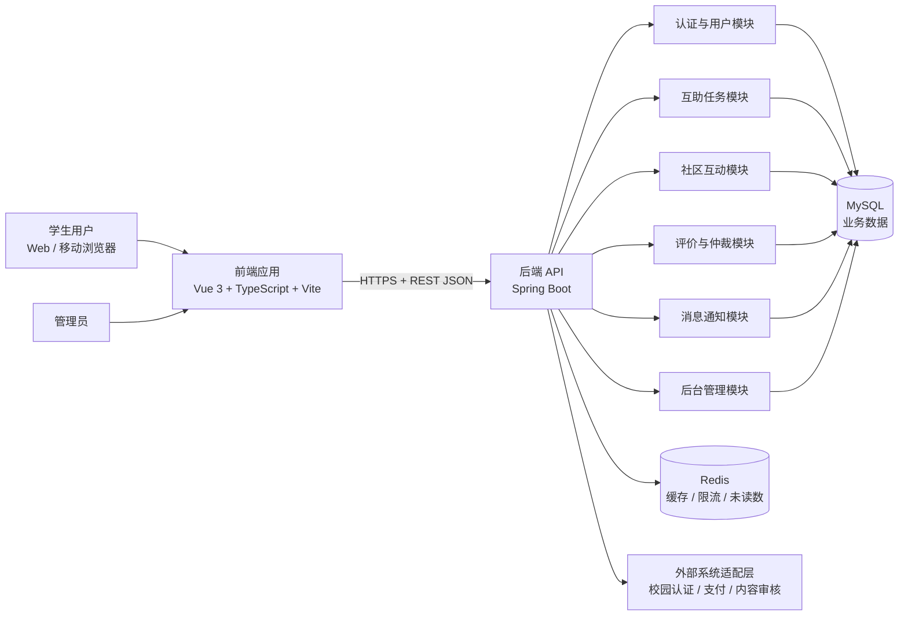
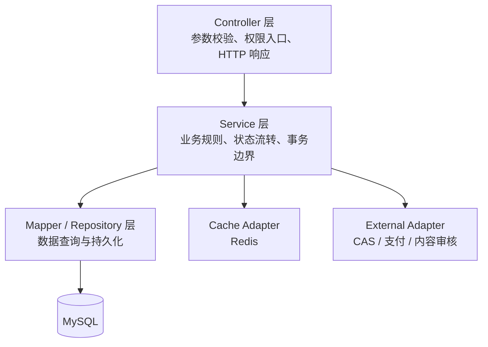
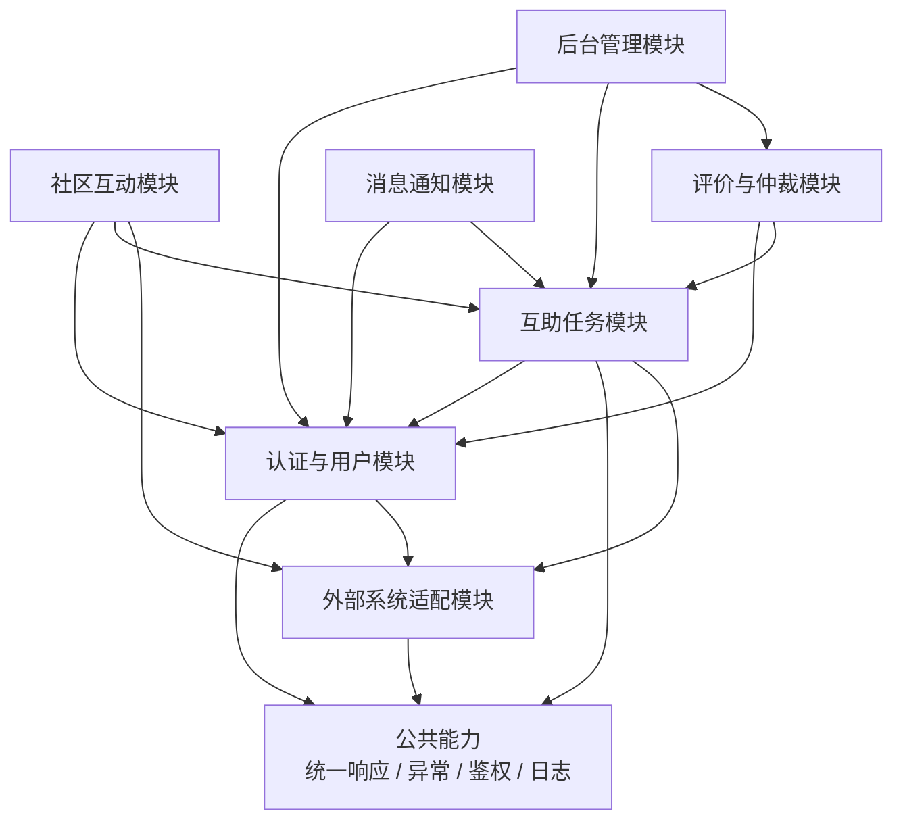
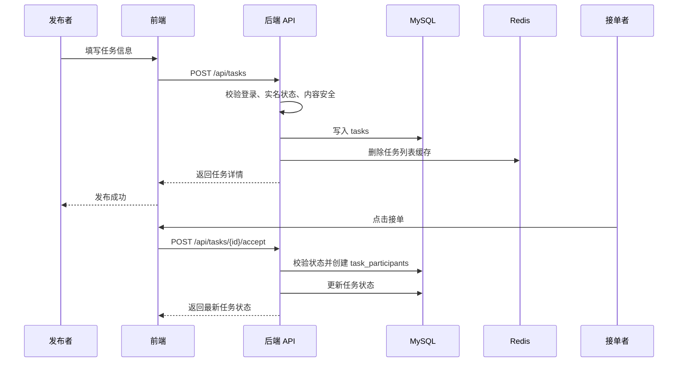
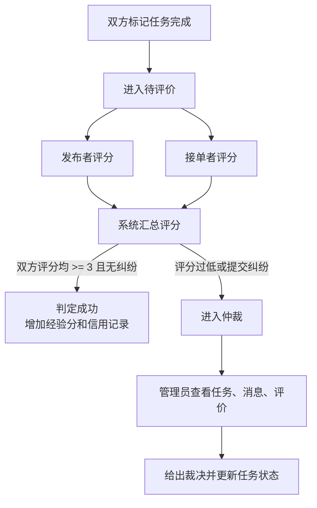

# 校园互助服务平台架构设计文档

## 1. 架构概览

### 1.1 架构风格

系统采用 **前后端分离 + 模块化分层单体架构**。

前端负责页面展示、表单交互、路由跳转和 API 调用；后端负责鉴权、业务规则、数据访问、权限控制、任务状态流转和系统管理；数据库负责持久化业务数据；Redis 用于缓存、令牌辅助校验、热点数据和轻量级限流。

该架构不是把所有代码简单放在一个项目中，而是在后端单体内部保持清晰模块边界。核心原则是：**部署形态保持简单，代码结构保持模块化，外部依赖通过适配层隔离**。

### 1.2 总体架构图



### 1.3 后端分层



分层职责：

| 层次 | 职责 | 说明 |
|------|------|------|
| Controller | 接收 REST 请求、基础参数校验、返回统一响应 | 不写复杂业务规则。 |
| Service | 处理业务规则、事务、状态机、权限细节 | 任务接单、完成、评价、仲裁等流程放在此层。 |
| Mapper / Repository | 数据库访问 | 使用 MyBatis-Plus 与 XML Mapper 管理复杂查询。 |
| Entity / DTO | 数据模型与接口模型 | Entity 面向数据库，DTO 面向接口，避免直接暴露敏感字段。 |
| Adapter | 外部系统隔离 | 校园认证、支付、内容审核后续替换时不影响核心业务。 |

## 2. 模块划分说明

### 2.1 模块清单

| 模块 | 主要职责 | 关键数据 | 对外接口方式 |
|------|----------|----------|--------------|
| 认证与用户模块 | 注册登录、JWT 签发与刷新、柔性实名、用户资料、用户设置、积分记录 | users、user_settings、user_login_logs、user_point_records | REST JSON |
| 互助任务模块 | 任务发布、任务列表、任务详情、接单、完成、取消、任务点赞 | tasks、task_participants、task_likes | REST JSON |
| 社区互动模块 | 匿名树洞、找搭子、评论、评论点赞、收藏类互动 | tasks、task_comments、task_comment_likes | REST JSON |
| 评价与仲裁模块 | 双向评分、成功判定、纠纷提交、管理员裁决入口 | task_reviews、feedback | REST JSON |
| 消息通知模块 | 站内消息、任务状态提醒、未读消息管理 | messages | REST JSON，后续可扩展 WebSocket |
| 后台管理模块 | 用户封禁、任务审核、公告管理、反馈处理 | users、tasks、announcements、feedback | REST JSON |
| 外部系统适配模块 | 校园认证、支付、内容安全审核 | 不直接拥有核心表 | Adapter 接口 |

### 2.2 模块依赖图



依赖规则：

- 所有业务模块依赖认证与用户模块获取当前用户、角色和状态。
- 评价与仲裁模块依赖任务模块的任务状态，但任务模块不反向依赖评价模块的内部实现。
- 社区互动复用任务表的 topic 模式，但匿名展示策略由社区模块控制。
- 后台管理模块可以调用用户、任务、评价等模块的管理服务，但普通业务模块不能依赖后台管理模块。
- 外部系统通过接口适配，业务模块不直接调用第三方 SDK。

### 2.3 关键接口定义

#### 认证与用户

| 接口 | 方法 | 请求数据 | 响应数据 | 说明 |
|------|------|----------|----------|------|
| `/api/auth/register` | POST | studentId、name、email、password | token、userProfile | 注册并创建默认设置。 |
| `/api/auth/login` | POST | studentId、password | token、refreshToken、userProfile | 登录并记录登录日志。 |
| `/api/auth/refresh` | POST | refreshToken | token | 刷新访问令牌。 |
| `/api/users/me` | GET | Authorization Header | userProfile | 返回脱敏后的当前用户信息。 |
| `/api/users/me/settings` | PUT | notificationEnabled、theme、language | userSettings | 更新用户设置。 |

#### 互助任务

| 接口 | 方法 | 请求数据 | 响应数据 | 说明 |
|------|------|----------|----------|------|
| `/api/tasks` | GET | type、category、status、keyword、page、size | taskPage | 分页查询任务和社区话题。 |
| `/api/tasks` | POST | title、description、category、taskMode、reward、location、contactInfo | taskDetail | 发布任务或话题。 |
| `/api/tasks/{id}` | GET | id | taskDetail | 查询详情。 |
| `/api/tasks/{id}/accept` | POST | id | taskDetail | 接单，创建参与关系。 |
| `/api/tasks/{id}/complete` | POST | id | taskDetail | 标记完成，双方均完成后进入评价。 |
| `/api/tasks/{id}/like` | POST | id | likeCount | 点赞或取消点赞。 |

#### 社区互动

| 接口 | 方法 | 请求数据 | 响应数据 | 说明 |
|------|------|----------|----------|------|
| `/api/tasks/{id}/comments` | GET | id、page、size | commentPage | 查询评论。 |
| `/api/tasks/{id}/comments` | POST | content、anonymous、parentId | commentDetail | 发表评论或回复。 |
| `/api/comments/{id}/like` | POST | id | likeCount | 评论点赞或取消点赞。 |

#### 评价与仲裁

| 接口 | 方法 | 请求数据 | 响应数据 | 说明 |
|------|------|----------|----------|------|
| `/api/tasks/{id}/reviews` | POST | rating、content、revieweeId | reviewDetail | 双向评价，更新信用分和经验分。 |
| `/api/feedback` | POST | type、title、content、taskId | feedbackDetail | 提交纠纷或反馈。 |
| `/api/admin/feedback/{id}` | PUT | status、adminReply | feedbackDetail | 管理员处理反馈。 |

#### 消息与后台管理

| 接口 | 方法 | 请求数据 | 响应数据 | 说明 |
|------|------|----------|----------|------|
| `/api/messages` | GET | page、size、status | messagePage | 查询站内消息。 |
| `/api/messages` | POST | receiverId、taskId、content | messageDetail | 发送站内消息。 |
| `/api/messages/{id}/read` | PUT | id | messageDetail | 标记已读。 |
| `/api/admin/tasks/{id}/review` | PUT | reviewStatus、reviewNote | taskDetail | 审核任务或社区内容。 |
| `/api/admin/users/{id}/status` | PUT | status、disabledReason | userProfile | 封禁或恢复用户。 |
| `/api/admin/announcements` | POST | title、content、pinned | announcementDetail | 发布公告。 |

### 2.4 数据格式约定

接口统一使用 JSON，时间采用 ISO-8601 或 `yyyy-MM-dd HH:mm:ss`，金额使用字符串或定点数传输，避免浮点误差。

统一响应格式：

```json
{
  "code": 0,
  "message": "ok",
  "data": {}
}
```

统一错误格式：

```json
{
  "code": 40001,
  "message": "任务已被接单",
  "data": null
}
```

### 2.5 核心业务流程

#### 任务发布与接单流程



#### 评价与仲裁流程



## 3. 技术选型说明

| 层次 | 选择 | 选择理由 |
|------|------|----------|
| 前端框架 | Vue 3 + TypeScript | 学习成本低，组件化能力成熟，适合快速实现管理端和学生端。 |
| 构建工具 | Vite | 启动快，适合课程项目高频迭代。 |
| 前端路由 | Vue Router | 支持学生端、管理端和详情页路由管理。 |
| HTTP 客户端 | Axios | 拦截器适合统一处理 JWT、错误提示和刷新令牌。 |
| 后端框架 | Java 17 + Spring Boot | 生态稳定，适合 REST API、权限控制和分层开发。 |
| 安全框架 | Spring Security + JWT | 支持无状态鉴权，便于前后端分离。 |
| ORM / 数据访问 | MyBatis-Plus + XML Mapper | 常规 CRUD 快，复杂查询可通过 XML 精确控制。 |
| 主数据库 | MySQL | 任务、用户、评价、消息等数据关系明确，需要事务与索引。 |
| 缓存中间件 | Redis | 用于热点任务列表、未读数、限流、验证码或令牌辅助校验。 |
| 消息队列 | 首版不引入 | 当前规模下同步处理足够；消息队列作为后续扩展项。 |
| 文档数据库 | 首版不引入 MongoDB | P1 曾提出非结构化数据需求，但当前树洞和评论可先由 MySQL TEXT 支撑，减少部署复杂度。 |
| 部署方式 | Docker Compose | 能统一启动前端、后端、MySQL、Redis，适合演示和测试环境。 |
| 日志与监控 | Spring Boot Actuator + 应用日志 | 先满足故障排查，后续可接入 Prometheus / Grafana。 |

## 4. 安全与隐私设计

### 4.1 柔性实名

真实学号、邮箱、手机号等敏感信息只在后端保存。交易相关页面展示认证标识和昵称，匿名树洞不展示真实身份。管理员在处理违规和纠纷时可以按权限追溯真实用户。

### 4.2 权限控制

- 未登录用户只能浏览公开内容。
- 普通用户可发布任务、接单、评论、评价、提交反馈。
- 管理员可审核任务、处理反馈、封禁用户、发布公告。
- 后端统一从 JWT 中解析用户身份，不能信任前端传入的 userId。

### 4.3 内容安全

任务标题、描述、评论和树洞内容在发布前进入内容校验。第一版可先采用敏感词规则和管理员审核，后续通过外部内容审核适配器接入 AI 审核服务。

### 4.4 数据保护

- 密码使用 bcrypt 或等价强哈希存储。
- 学号、手机号等敏感字段在展示层脱敏。
- 关键操作记录日志，包括登录、任务审核、封禁、仲裁。
- 禁止接口返回 password、真实学号明文等字段。

## 5. 可扩展性设计

### 5.1 从分层单体演进到服务拆分

如果后续用户量扩大，可优先拆分以下模块：

1. 消息通知模块：适合独立为通知服务，并引入 WebSocket 或消息队列。
2. 内容审核模块：适合异步审核和第三方服务适配。
3. 支付模块：如果接入真实支付，需要独立风控、回调验签和对账能力。

### 5.2 异步扩展点

首版不强依赖消息队列，但 Service 层可保留领域事件方法，例如：

- `TaskCompletedEvent`：用于增加经验分、发送通知。
- `CommentCreatedEvent`：用于更新未读数或内容审核。
- `FeedbackCreatedEvent`：用于提醒管理员。

第一版可同步调用，后续替换为 MQ 消费不影响 Controller 接口。

## 6. 风险与应对

| 风险 | 影响 | 应对 |
|------|------|------|
| 匿名社区与实名追溯冲突 | 可能造成隐私泄露或治理困难 | 匿名只影响前台展示，后台保留最小必要追溯能力并限制管理员权限。 |
| 任务状态流转复杂 | 接单、完成、评价、仲裁状态容易不一致 | 在 Service 层集中实现状态机，关键更新使用事务。 |
| Redis 不可用 | 缓存、限流、未读数可能受影响 | Redis 只做性能优化，不作为唯一事实来源；核心数据落 MySQL。 |
| 内容审核不足 | 树洞和评论可能出现违规内容 | 首版使用敏感词 + 管理员审核，后续通过适配器接 AI 内容审核。 |
| 外部支付和校园认证接口不可用 | 阻塞真实交易和实名验证 | 首版提供模拟适配器，接口稳定后替换实现。 |

## 7. 与 P1 需求的对应关系

| P1 需求 | 架构支撑 |
|---------|----------|
| FR-01 柔性实名认证 | 认证与用户模块、权限控制、脱敏 DTO。 |
| FR-02 多类型任务发布 | 互助任务模块，taskMode 区分 task 和 topic。 |
| FR-03 树洞与找搭子 | 社区互动模块，匿名展示策略和内容审核适配。 |
| FR-04 双向评价与仲裁 | 评价与仲裁模块，任务状态机和管理员处理接口。 |
| FR-05 消息通知 | 消息通知模块，首版站内消息，后续可扩展 WebSocket。 |
| NFR 性能 | MySQL 索引、分页、Redis 缓存、前端静态资源缓存。 |
| NFR 安全 | JWT、Spring Security、密码强哈希、敏感信息脱敏。 |
| NFR 可维护性 | 后端分层、模块边界、外部系统适配层。 |
