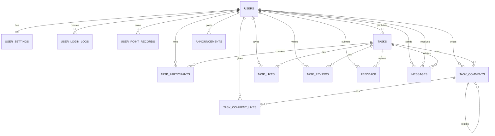

# ER 图与建表 SQL 设计

## 1. 设计原则

- 优先复用当前项目已有表结构
- 围绕 `users` 与 `tasks` 两个核心实体展开
- 保持第三范式，避免把评论、点赞、评价、消息塞回单表
- 兼顾“任务”和“社区话题”两类内容，用 `task_mode` 区分

## 2. ER 图



## 3. 核心实体说明

| 实体 | 作用 | 主键 | 关键外键 |
|---|---|---|---|
| `users` | 用户主表 | `id` | 无 |
| `user_settings` | 用户设置 | `id` | `user_id -> users.id` |
| `tasks` | 任务/话题主表 | `id` | `requester_id -> users.id` |
| `task_participants` | 接单/参与关系 | `id` | `task_id`、`participant_id` |
| `task_comments` | 评论与回复 | `id` | `task_id`、`author_id`、`parent_id` |
| `task_likes` | 任务点赞关系 | `id` | `task_id`、`user_id` |
| `task_comment_likes` | 评论点赞关系 | `id` | `comment_id`、`user_id` |
| `task_reviews` | 双向评价 | `id` | `task_id`、`reviewer_id`、`reviewee_id` |
| `messages` | 站内消息 | `id` | `sender_id`、`receiver_id`、`task_id` |
| `feedback` | 纠纷与反馈 | `id` | `user_id`、`admin_id` |
| `announcements` | 公告 | `id` | `author_id` |

## 4. 建表 SQL

以下 SQL 以当前项目已有 `schema.sql` 为基础整理。

### 4.1 用户表

```sql
CREATE TABLE users (
    id BIGINT NOT NULL AUTO_INCREMENT PRIMARY KEY,
    student_id VARCHAR(64) NOT NULL,
    name VARCHAR(100) NOT NULL,
    email VARCHAR(255) NOT NULL,
    password VARCHAR(255) NOT NULL,
    avatar_url MEDIUMTEXT NULL,
    major VARCHAR(100) NULL,
    role VARCHAR(32) NOT NULL DEFAULT 'USER',
    status VARCHAR(32) NOT NULL DEFAULT 'ACTIVE',
    disabled_reason VARCHAR(255) NULL,
    score DECIMAL(10,2) NOT NULL DEFAULT 0.00,
    points INT NOT NULL DEFAULT 0,
    last_login_at DATETIME NULL,
    created_at DATETIME NOT NULL,
    updated_at DATETIME NOT NULL,
    UNIQUE KEY uk_users_student_id (student_id),
    UNIQUE KEY uk_users_email (email)
);
```

### 4.2 任务主表

```sql
CREATE TABLE tasks (
    id BIGINT NOT NULL AUTO_INCREMENT PRIMARY KEY,
    requester_id BIGINT NOT NULL,
    title VARCHAR(255) NOT NULL,
    description TEXT NOT NULL,
    category VARCHAR(100) NULL,
    task_mode VARCHAR(32) NOT NULL DEFAULT 'task',
    badge_primary VARCHAR(100) NULL,
    badge_secondary VARCHAR(100) NULL,
    location_text VARCHAR(255) NULL,
    time_text VARCHAR(255) NULL,
    reward_title VARCHAR(100) NULL,
    reward_text VARCHAR(255) NULL,
    impact_title VARCHAR(100) NULL,
    impact_text VARCHAR(255) NULL,
    map_image_url VARCHAR(500) NULL,
    contact_info VARCHAR(255) NULL,
    review_status VARCHAR(32) NOT NULL DEFAULT 'approved',
    review_note VARCHAR(255) NULL,
    reviewed_by BIGINT NULL,
    reviewed_at DATETIME NULL,
    status VARCHAR(32) NOT NULL,
    like_count INT NOT NULL DEFAULT 0,
    expires_at DATETIME NULL,
    requester_completed_at DATETIME NULL,
    helper_completed_at DATETIME NULL,
    completed_at DATETIME NULL,
    created_at DATETIME NOT NULL,
    updated_at DATETIME NOT NULL,
    KEY idx_tasks_requester_id (requester_id),
    KEY idx_tasks_status (status),
    KEY idx_tasks_task_mode (task_mode),
    KEY idx_tasks_review_status (review_status)
);
```

### 4.3 任务参与表

```sql
CREATE TABLE task_participants (
    id BIGINT NOT NULL AUTO_INCREMENT PRIMARY KEY,
    task_id BIGINT NOT NULL,
    participant_id BIGINT NOT NULL,
    role VARCHAR(32) NOT NULL,
    status VARCHAR(32) NOT NULL,
    created_at DATETIME NOT NULL,
    updated_at DATETIME NOT NULL,
    KEY idx_task_participants_task_id (task_id),
    KEY idx_task_participants_participant_id (participant_id)
);
```

### 4.4 评论与点赞

```sql
CREATE TABLE task_comments (
    id BIGINT NOT NULL AUTO_INCREMENT PRIMARY KEY,
    task_id BIGINT NOT NULL,
    author_id BIGINT NOT NULL,
    parent_id BIGINT NULL,
    content TEXT NOT NULL,
    like_count INT NOT NULL DEFAULT 0,
    created_at DATETIME NOT NULL,
    updated_at DATETIME NOT NULL,
    KEY idx_task_comments_task_id (task_id),
    KEY idx_task_comments_author_id (author_id),
    KEY idx_task_comments_parent_id (parent_id)
);

CREATE TABLE task_likes (
    id BIGINT NOT NULL AUTO_INCREMENT PRIMARY KEY,
    task_id BIGINT NOT NULL,
    user_id BIGINT NOT NULL,
    created_at DATETIME NOT NULL,
    UNIQUE KEY uk_task_likes_task_user (task_id, user_id)
);

CREATE TABLE task_comment_likes (
    id BIGINT NOT NULL AUTO_INCREMENT PRIMARY KEY,
    comment_id BIGINT NOT NULL,
    user_id BIGINT NOT NULL,
    created_at DATETIME NOT NULL,
    UNIQUE KEY uk_task_comment_likes_comment_user (comment_id, user_id)
);
```

### 4.5 评价、消息、反馈

```sql
CREATE TABLE task_reviews (
    id BIGINT NOT NULL AUTO_INCREMENT PRIMARY KEY,
    task_id BIGINT NOT NULL,
    reviewer_id BIGINT NOT NULL,
    reviewee_id BIGINT NOT NULL,
    reviewer_role VARCHAR(32) NOT NULL,
    rating INT NOT NULL,
    content TEXT NULL,
    created_at DATETIME NOT NULL,
    updated_at DATETIME NOT NULL,
    UNIQUE KEY uk_task_reviews_task_reviewer (task_id, reviewer_id)
);

CREATE TABLE messages (
    id BIGINT NOT NULL AUTO_INCREMENT PRIMARY KEY,
    sender_id BIGINT NOT NULL,
    receiver_id BIGINT NOT NULL,
    task_id BIGINT NULL,
    content TEXT NOT NULL,
    status VARCHAR(32) NOT NULL,
    created_at DATETIME NOT NULL,
    KEY idx_messages_receiver_status_created (receiver_id, status, created_at),
    KEY idx_messages_sender_created (sender_id, created_at)
);

CREATE TABLE feedback (
    id BIGINT NOT NULL AUTO_INCREMENT PRIMARY KEY,
    user_id BIGINT NOT NULL,
    type VARCHAR(32) NOT NULL,
    title VARCHAR(255) NOT NULL,
    content TEXT NOT NULL,
    status VARCHAR(32) NOT NULL DEFAULT 'open',
    admin_reply TEXT NULL,
    admin_id BIGINT NULL,
    handled_at DATETIME NULL,
    created_at DATETIME NOT NULL,
    updated_at DATETIME NOT NULL,
    KEY idx_feedback_user_id (user_id),
    KEY idx_feedback_status_created_at (status, created_at)
);
```

## 5. 索引设计说明

| 表 | 索引 | 目的 |
|---|---|---|
| `users` | `uk_users_student_id`、`uk_users_email` | 保证学号与邮箱唯一，支持登录查询 |
| `tasks` | `idx_tasks_status` | 支撑任务列表按状态筛选 |
| `tasks` | `idx_tasks_task_mode` | 支撑任务/话题模式切换 |
| `tasks` | `idx_tasks_review_status` | 支撑后台审核列表 |
| `task_participants` | `idx_task_participants_task_id` | 查询任务参与者 |
| `task_comments` | `idx_task_comments_task_id` | 查询某任务的评论列表 |
| `messages` | `idx_messages_receiver_status_created` | 查询用户未读消息与消息中心 |
| `feedback` | `idx_feedback_status_created_at` | 支撑后台按状态处理纠纷 |
| `task_likes` | 唯一联合索引 | 防止同一用户重复点赞 |
| `task_reviews` | 唯一联合索引 | 防止同一评价人重复评价同一任务 |

## 6. 第三范式审查

### 6.1 满足第三范式的地方

- 评论、点赞、评价、参与关系均已拆表，避免多值字段。
- 用户设置单独拆为 `user_settings`，避免和主用户档案强耦合。
- 积分流水单独存储于 `user_point_records`，避免覆盖历史。

### 6.2 允许的反规范化

- `tasks.like_count`
- `task_comments.like_count`

这两个字段是为了提高读取效率保留的计数字段，属于可接受的缓存式冗余，需要通过业务逻辑维护一致性。

## 7. 隐私与安全设计

### 7.1 密码存储

- 密码不得明文保存。
- 服务端应使用强哈希算法存储，如 `BCrypt`。
- 当前项目存在 `PasswordUtil`，设计上应由该工具统一处理密码加密与校验。

### 7.2 手机号与联系方式

- 当前表中未单独存手机号，采用 `contact_info` 文本字段。
- 该字段只能在达到特定业务阶段后对任务参与方可见。
- 若后续接入真实手机号，建议单独字段并做脱敏展示，必要时加密存储。

### 7.3 柔性实名

- `student_id` 仅后台持久化与校验使用。
- 前台返回用户信息时应脱敏显示，避免泄漏完整实名身份。

## 8. 潜在性能瓶颈与改进

| 风险点 | 说明 | 改进建议 |
|---|---|---|
| `tasks` 承担任务与话题双重职责 | 列表查询条件可能越来越复杂 | 中期可拆分查询视图或独立内容表 |
| 评论树递归查询 | 深层回复会带来性能波动 | 限制层级，或使用路径字段优化 |
| 未读消息高频查询 | 用户消息中心访问频繁 | 保留组合索引，必要时引入 Redis 未读数缓存 |
| 评价完成后的聚合计算 | 多次重复统计信用分 | 把最终分值写入用户画像并记录流水 |

## 9. 结论

当前数据库设计基本满足第三范式与首版业务需求，且与现有 `schema.sql` 一致。首版最合理的演进方向不是立即拆库，而是先把状态流转、聚合统计和内容审核做稳。
