# 类图与设计模式说明

## 1. 设计范围

本类图覆盖 P0 优先级能力，并与当前项目后端结构保持一致：

- 认证与用户
- 任务发布、浏览、接单、完成
- 评论、点赞、消息
- 评价与反馈仲裁
- 后台审核与用户状态管理

## 2. 核心类图

```mermaid
classDiagram
    class AuthController {
        +register(RegisterRequest)
        +login(LoginRequest)
        +refreshToken(String)
    }

    class UserController {
        +getCurrentUser()
        +updateSettings(UserSettingDTO)
    }

    class TaskController {
        +listTasks(TaskQuery)
        +createTask(TaskCreateRequest)
        +getTask(Long)
        +acceptTask(Long)
        +completeTask(Long)
        +toggleLike(Long)
    }

    class TaskCommentController {
        +listComments(Long, PageQuery)
        +createComment(Long, TaskCommentCreateRequest)
        +toggleCommentLike(Long)
    }

    class TaskReviewController {
        +createReview(Long, TaskReviewCreateRequest)
    }

    class MessageController {
        +listMessages(PageQuery)
        +createMessage(MessageRequest)
        +markRead(Long)
    }

    class FeedbackController {
        +createFeedback(FeedbackCreateRequest)
    }

    class AdminController {
        +reviewTask(Long, AdminTaskReviewRequest)
        +updateUserStatus(Long, AdminUserStatusUpdateRequest)
        +handleFeedback(Long, AdminFeedbackUpdateRequest)
        +createAnnouncement(AdminAnnouncementRequest)
    }

    class AuthService {
        +register()
        +login()
        +refresh()
    }

    class UserService {
        +getCurrentProfile()
        +updateSettings()
        +updateCreditScore()
        +addPointsRecord()
    }

    class TaskService {
        +createTask()
        +listTasks()
        +acceptTask()
        +completeTask()
        +toggleLike()
        +changeTaskStatus()
    }

    class TaskCommentService {
        +listComments()
        +createComment()
        +toggleLike()
    }

    class TaskReviewService {
        +createReview()
        +aggregateResult()
    }

    class MessageService {
        +listMessages()
        +sendMessage()
        +markRead()
    }

    class FeedbackService {
        +createFeedback()
        +handleFeedback()
    }

    class AdminService {
        +reviewTask()
        +updateUserStatus()
        +createAnnouncement()
    }

    class User {
        +id: Long
        +studentId: String
        +name: String
        +email: String
        +password: String
        +role: String
        +status: String
        +score: Decimal
        +points: Integer
    }

    class UserSetting {
        +id: Long
        +userId: Long
        +notificationEnabled: Boolean
        +theme: String
        +language: String
    }

    class Task {
        +id: Long
        +requesterId: Long
        +title: String
        +description: String
        +category: String
        +taskMode: String
        +contactInfo: String
        +reviewStatus: String
        +status: String
        +likeCount: Integer
        +expiresAt: DateTime
    }

    class TaskParticipant {
        +id: Long
        +taskId: Long
        +participantId: Long
        +role: String
        +status: String
    }

    class TaskComment {
        +id: Long
        +taskId: Long
        +authorId: Long
        +parentId: Long
        +content: String
        +likeCount: Integer
    }

    class TaskLike {
        +id: Long
        +taskId: Long
        +userId: Long
    }

    class TaskReview {
        +id: Long
        +taskId: Long
        +reviewerId: Long
        +revieweeId: Long
        +reviewerRole: String
        +rating: Integer
        +content: String
    }

    class Message {
        +id: Long
        +senderId: Long
        +receiverId: Long
        +taskId: Long
        +content: String
        +status: String
    }

    class Feedback {
        +id: Long
        +userId: Long
        +type: String
        +title: String
        +content: String
        +status: String
    }

    class Announcement {
        +id: Long
        +authorId: Long
        +title: String
        +content: String
        +pinned: Boolean
    }

    AuthController --> AuthService
    UserController --> UserService
    TaskController --> TaskService
    TaskCommentController --> TaskCommentService
    TaskReviewController --> TaskReviewService
    MessageController --> MessageService
    FeedbackController --> FeedbackService
    AdminController --> AdminService

    AuthService --> User
    UserService --> User
    UserService --> UserSetting
    TaskService --> Task
    TaskService --> TaskParticipant
    TaskService --> TaskLike
    TaskCommentService --> TaskComment
    TaskReviewService --> TaskReview
    TaskReviewService --> Task
    TaskReviewService --> User
    MessageService --> Message
    FeedbackService --> Feedback
    AdminService --> Task
    AdminService --> Feedback
    AdminService --> Announcement

    User "1" --> "1" UserSetting : owns
    User "1" --> "0..*" Task : publishes
    Task "1" --> "0..*" TaskParticipant : contains
    Task "1" --> "0..*" TaskComment : contains
    Task "1" --> "0..*" TaskLike : contains
    Task "1" --> "0..*" TaskReview : contains
    Task "1" --> "0..*" Message : context
    User "1" --> "0..*" Feedback : submits
```

## 3. 类职责说明

| 类/模块 | 职责 |
|---|---|
| `AuthController` / `AuthService` | 处理注册、登录、令牌刷新、登录日志记录 |
| `UserService` | 管理个人资料、设置、积分、信用分等用户域逻辑 |
| `TaskService` | 处理任务/话题发布、筛选、接单、完结、点赞、状态流转 |
| `TaskCommentService` | 处理评论树、回复、评论点赞 |
| `TaskReviewService` | 双向评价、评分汇总、成功/仲裁判定触发 |
| `MessageService` | 站内信收发、已读管理、任务状态提醒 |
| `FeedbackService` | 用户反馈、纠纷提交、处理结果维护 |
| `AdminService` | 后台审核、封禁、公告与仲裁处理 |

## 4. 设计模式应用

### 4.1 策略模式：任务模式解析与展示策略

**应用位置**

- `TaskModeResolver`
- `TaskService` 中对 `task` 与 `topic` 两类数据的行为分流

**为什么使用**

- 当前系统把“跑腿/交易”与“树洞/搭子”统一存放于 `tasks` 表，但业务规则不同。
- 通过策略模式可按 `taskMode` 分离校验、展示和状态流转规则。

**如果不用会怎样**

- `TaskService` 会堆满 `if-else`。
- 后续新增“咨询类”或“活动组队类”时会频繁修改旧逻辑，破坏开闭原则。

### 4.2 适配器模式：外部认证/内容审核/支付接入

**应用位置**

- P2 已定义“外部系统适配层”
- 适用于校园认证、内容审核、支付等三方能力

**为什么使用**

- 业务层只依赖统一接口，不直接耦合第三方 SDK。
- 便于在开发环境使用 Mock，在生产环境替换真实实现。

**如果不用会怎样**

- 控制器或 Service 会直接依赖第三方接口细节。
- 一旦供应商切换，改动范围会扩散到认证、任务发布、安全审核等多个模块。

### 4.3 模板方法模式：后台审核流程

**应用位置**

- `AdminService` 的任务审核、反馈处理、用户封禁

**为什么使用**

- 不同审核对象都遵循“加载对象 -> 校验权限 -> 更新状态 -> 记录操作 -> 发送通知”的固定流程。
- 只有状态字段和结果消息不同，适合抽公共骨架。

**如果不用会怎样**

- 多个后台接口会出现大量重复代码。
- 审计记录、权限校验和消息发送容易漏掉，导致行为不一致。

## 5. 设计结论

- 当前类划分已经具备典型的 Controller / Service / Entity 分层。
- `Task` 作为核心聚合根，连接任务、参与者、评论、点赞、评价、消息等对象。
- 为控制复杂度，建议继续把“状态流转规则”和“外部依赖”从 `TaskService` 中抽离成策略与适配接口。
