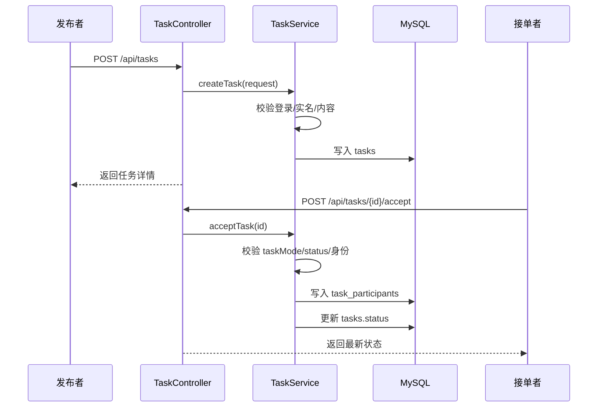
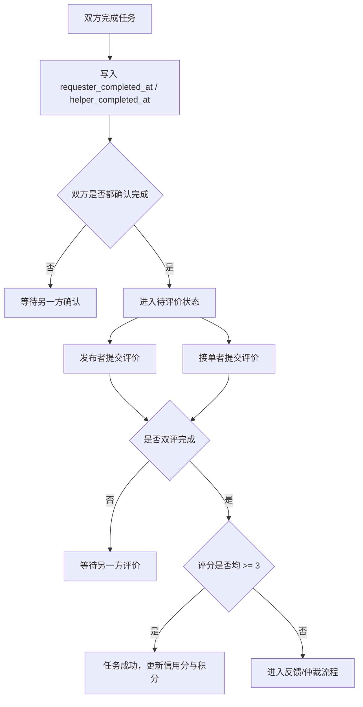

# 校园互助服务平台详细设计文档

## 1. 文档目的

本文档为校园互助服务平台的 P3 详细设计整合版，目标是把 P1 需求与 P2 架构进一步落到可实现的类、接口和数据库结构上，并与当前项目现有实现保持一致。

## 2. 当前项目实现基线

从当前仓库可识别出以下后端结构：

- 应用入口：`CampusHubApplication`
- 配置：`SecurityConfig`、`JwtAuthenticationFilter`、`RedisConfig`、`MyBatisConfig`
- 控制器：`AuthController`、`UserController`、`TaskController`、`TaskCommentController`、`TaskReviewController`、`MessageController`、`FeedbackController`、`AdminController`、`AnnouncementController`
- 服务层：`AuthService`、`UserService`、`TaskService`、`TaskCommentService`、`TaskReviewService`、`MessageService`、`FeedbackService`、`AdminService`、`AnnouncementService`
- 数据层：`Mapper` + MyBatis XML
- 工具类：`JwtUtil`、`PasswordUtil`、`TaskModeResolver`

由此可见，系统采用的是典型的前后端分离、后端分层单体实现。

## 3. 核心设计目标

### 3.1 目标一：支撑 P0 业务闭环

必须完整支持以下最小闭环：

1. 注册登录
2. 发布任务
3. 浏览与筛选任务
4. 接单与完成
5. 评论与点赞
6. 双向评价
7. 纠纷反馈
8. 消息通知

### 3.2 目标二：兼顾任务与社区话题

系统并不只做“跑腿接单”，还需要承载树洞、找搭子等社区内容。因此详细设计采用以下方案：

- 统一使用 `tasks` 作为内容主表
- 用 `task_mode` 区分 `task` 与 `topic`
- 用不同状态机和权限规则处理差异行为

### 3.3 目标三：保证后续可扩展

- 三方校园认证、内容审核、支付能力通过适配层隔离
- 后台审核与普通学生端接口清晰分离
- 使用组合关系而不是过深继承树表达业务

## 4. 模块详细设计

### 4.1 认证与用户模块

**职责**

- 用户注册、登录、刷新令牌
- 记录登录日志
- 读取当前用户信息
- 更新用户设置
- 维护信用分与经验分

**关键对象**

- `User`
- `UserSetting`
- `UserLoginLog`
- `UserPointRecord`

**关键规则**

- 学号和邮箱全局唯一
- 密码必须加密存储
- 被封禁用户不能登录或参与任务
- 返回前端的学号需要脱敏

### 4.2 任务与话题模块

**职责**

- 创建任务或话题
- 按分类、状态、关键字查询
- 接单、完结、点赞
- 控制联系方式开放时机

**关键对象**

- `Task`
- `TaskParticipant`
- `TaskLike`

**关键规则**

- `taskMode=task` 才允许接单与完成
- `taskMode=topic` 更偏向树洞、搭子、咨询话题
- 自己不能接自己的任务
- 任务状态发生变化时需要通知相关用户

**建议状态流转**

```text
OPEN -> IN_PROGRESS -> PENDING_REVIEW -> DONE
OPEN -> CANCELLED
IN_PROGRESS -> DISPUTED
```

### 4.3 评论互动模块

**职责**

- 评论、回复、点赞
- 为任务和话题提供社区互动能力

**关键对象**

- `TaskComment`
- `TaskCommentLike`

**关键规则**

- 支持父评论 `parentId`，形成最多两层回复
- 评论内容需要经过内容审核
- 点赞使用联合唯一索引防重

### 4.4 评价与仲裁模块

**职责**

- 双向评价
- 汇总评分结果
- 低分或争议场景触发仲裁

**关键对象**

- `TaskReview`
- `Feedback`

**关键规则**

- 同一用户对同一任务只能评价一次
- 只有任务参与者可评价
- 双方评分均不低于 3 分，视为成功互助
- 低分、冲突评价或主动申诉进入纠纷处理

### 4.5 消息与后台管理模块

**职责**

- 站内消息发送与已读管理
- 内容审核
- 用户封禁/解封
- 反馈处理
- 公告发布

**关键对象**

- `Message`
- `Announcement`

**关键规则**

- 用户只能查看自己的消息
- 管理接口只对 `ADMIN` 角色开放
- 审核操作应保留操作人和操作时间

## 5. 关键流程设计

### 5.1 发布与接单流程



### 5.2 完成与评价流程



## 6. API 详细设计结论

核心资源与路径如下：

- `/api/auth/*`
- `/api/users/me`
- `/api/tasks`
- `/api/tasks/{id}/accept`
- `/api/tasks/{id}/comments`
- `/api/tasks/{id}/reviews`
- `/api/messages`
- `/api/feedback`
- `/api/admin/*`

详细参数与错误码见 [API规范文档](./API规范文档.md)。

## 7. 数据库详细设计结论

数据库以如下关系为核心：

- 用户主表 + 设置 + 登录日志 + 积分流水
- 任务主表 + 参与者 + 评论 + 点赞 + 评价
- 反馈 + 消息 + 公告

详细 ER 图和建表语句见 [ER图与建表SQL设计](./ER图与建表SQL设计.md)。

## 8. 安全与隐私设计

### 8.1 登录与鉴权

- 使用 JWT 作为访问令牌
- 关键接口需要认证拦截
- 管理端接口做角色鉴权

### 8.2 隐私保护

- 学号前台脱敏展示
- `contact_info` 在达到业务阶段前不可直接暴露
- 匿名话题不显示实名信息

### 8.3 内容安全

- 任务、树洞、评论提交前经过内容审核
- 后台提供审核状态与原因记录

## 9. 设计模式与 SOLID 落地

本设计至少落地以下模式：

- 策略模式：`taskMode` 行为分流
- 适配器模式：校园认证、内容审核、支付接入
- 模板方法模式：后台审核流程骨架

SOLID 审查结果见 [SOLID检查清单](./SOLID检查清单.md)。

## 10. 与当前实现的差距

当前仓库已具备较完整后端骨架，但仍可预见以下后续工作：

1. 将 `TaskService` 中可能增长的状态机逻辑进一步抽象。
2. 明确 `topic` 模式下匿名展示、不可接单、评论优先的规则。
3. 补齐前端页面与接口联调文档。
4. 对内容审核、校园认证、支付采用正式适配接口而非占位实现。

## 11. 结论

本详细设计在不脱离当前项目结构的前提下，完成了类图、接口、数据库和关键流程的落地定义，能够直接作为后续代码完善、测试设计和答辩说明的依据。
